# Multi-Agent Threat Response System (MATS)

## Overview

This project implements a Multi-Agent Threat Response System (MATS), an advanced, adaptive cybersecurity framework designed to autonomously detect, analyze, and respond to network threats in real-time. By leveraging a multi-agent architecture powered by machine learning and reinforcement learning, MATS aims to create a resilient and intelligent defense mechanism that continuously learns from and adapts to the evolving threat landscape.

## Problem Statement

The primary objective is to develop an AI-based multi-agent system that can detect, prevent, and respond to cybersecurity threats within an organization. The system must be capable of simulating various attack scenarios, defense mechanisms, and response strategies to build a robust and adaptive security posture.

## The Data

The system is designed to ingest and process a variety of cybersecurity data sources to gain a comprehensive view of the network and system activities. The datasets, while synthetic, are designed to closely resemble real-world data.

-   **Network Traffic Data:** Logs capturing network flows, packet details, and anomalies.
-   **System Event Logs:** OS, application, and security logs indicating suspicious activities.
-   **Threat Intelligence Feeds:** Indicators of Compromise (IOCs), known attack signatures, and vulnerability data.
-   **User Behavior Data:** Login patterns, access logs, and behavioral anomalies.
-   **Configuration Data:** System/network configurations, patch levels, and security policies.

## Architecture

The system is composed of three core intelligent agents working in a coordinated feedback loop. The overall architecture is detailed in the `Architecure_Diagram.svg` file.

  

### System Components

#### 1. Detection Agent
-   **Core Function:** **ML-Based Threat Analysis**
-   **Description:** This agent ingests and analyzes real-time data from network traffic, system event logs, and threat intelligence feeds. It utilizes sophisticated machine learning models (both supervised and unsupervised) to identify anomalies and detect potential threats. When a credible threat is identified, it generates and passes "Threat Intelligence" to the Response Agent. Its models are continuously updated by the Learning Agent to improve detection accuracy.

#### 2. Response Agent
-   **Core Function:** **Policy-Driven Actions**
-   **Description:** The Response Agent acts as the system's enforcer. Upon receiving "Threat Intelligence," it consults its action policy, which is dynamically refined by the Learning Agent. Based on the policy, it executes appropriate security actions (e.g., blocking an IP address, isolating a system, or initiating a scan). The outcome of its actions is reported back to the Learning Agent.

#### 3. Learning Agent
-   **Core Function:** **Reinforcement Learning Core**
-   **Description:** This is the brain of the system, responsible for adaptation and improvement. It receives "Action Results" from the Response Agent and uses reinforcement learning to evaluate the effectiveness of the actions taken. Based on this feedback, it performs two critical updates:
    -   **Policy Refinement:** It refines the rules and strategies used by the Response Agent to ensure more effective actions in the future.
    -   **Model Updates:** It updates the machine learning models used by the Detection Agent, helping it to better recognize new or evolving threats.

## Workflow

The system operates in a continuous, cyclical workflow:

1.  **Ingestion:** The **Detection Agent** receives live streams of network events, system logs, and other relevant data.
2.  **Detection:** The agent analyzes the data using its ML models. If a threat is found, it forwards the intelligence to the **Response Agent**.
3.  **Action:** The **Response Agent** executes a policy-driven action to mitigate the threat and reports the result to the **Learning Agent**.
4.  **Learning & Adaptation:** The **Learning Agent** analyzes the action's outcome. It then sends "Policy Refinement" to the **Response Agent** and "Model Updates" to the **Detection Agent**.
5.  **Feedback Loop:** This process creates a perpetual feedback loop, allowing the system to become progressively more intelligent and effective at identifying and neutralizing threats over time.

## Technical Stack & Approach

-   **Detection Agent (Machine Learning):**
    -   A hybrid approach will be used for threat detection:
    -   **Scikit-learn:** For implementing baseline models, including **Isolation Forest** for unsupervised anomaly detection and **Random Forest** for supervised classification of known threat patterns.
    -   **TensorFlow (Keras):** To build, train, and deploy a **Long Short-Term Memory (LSTM)** neural network, which is well-suited for analyzing sequential log data and identifying temporal anomalies.

-   **Response Agent (Policy Engine):**
    -   The agent's logic will be implemented in Python, centered around a dynamic policy table. This table will map threat signatures and severity levels to discrete actions (e.g., `block_ip`, `isolate_host`, `run_scan`). The policy will be stored in a format that can be easily updated by the Learning Agent.

-   **Learning Agent (Reinforcement Learning):**
    -   **Framework:** We will use **TF-Agents**, a library for TensorFlow, to design and train the reinforcement learning agent.
    -   **Algorithm:** A **Deep Q-Network (DQN)** will be implemented. The state will be represented by the threat type and context, actions will be the responses (block, alert, etc.), and the reward will be calculated based on the effectiveness of the action (e.g., positive reward for stopping a verified threat, negative reward for blocking benign traffic or failing to stop a threat).

-   **Evaluation Metrics:**
    -   **Detection Model:** Accuracy, Precision, Recall, F1-Score, and False Positive/Negative Rates.
    -   **Response Effectiveness:** Time to contain threats and the impact of response actions.
